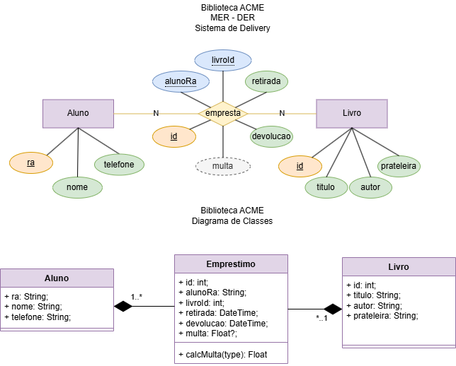

# BIBLIOTECA ACME API
Situação de Aprendizagem - Back-End (Node.JS, JavaSript, VsCode, ORM Prisma, Insomnia)
## Contextualização
A BIBLIOTECA ACME é a biblioteca da escola ACME, é nossa cliente e necessita de um sistema Web para registro dos empréstimos de livros.<br>O P.O. após uma visita ao cliente, elaborou o DER e UML DC(Diagrama de Classes) a seguir e elencou os requisitos funcionais.<br>


### Requisitos funcionais
- [RF001] O sistema deve permitir o CRUD de alunos.
    - [RF001.1] A rota **readOne** do **aluno** deve mostrar os dados de um aluno e seus empréstimos, contendo os dados dos livros emprestados.
- [RF002] O sistema deve permitir o CRUD de emprestimo.
    - [RF002.1] O sistema deve associar o emprestimo a um aluno e a um livro.
    - [RF002.2] Ao cadastrar um novo emprestimo **create** no controller, a data e hora da **retirada** deve ser gerada pelo Banco de Dados @dedault(now()).
    - [RF002.3] Ao cadastrar uma novo emprestimo **create** no controller, a **devolucao**, deve ser nula **"?"** pois será preenchida na rota **update** quando o aluno devolver o livro.
    - [RF002.4] Se ao realizar **update** o campo **devolucao** for enviado o sistema deve calcular a **multa** que segue o seguinte critério:
        - O aluno pode ficar apenas 3 dias com o livro.
        - Se a data da devolução for mais de três dias após a data da retirada, deverá ser cobrada uma multa de 10.00 por dia.

### Casos de teste (Insomnia)
- [CT001] Deve ser cadastrado pelo menos 5 alunos.
- [CT002] Cadastre, altere e exclua um aluno.
- [CT003] Deve ser cadastrado pelo menos 10 livros.
- [CT004] Cadastre uma emprestimo para cada aluno.
    - [CT004.1] Pelo menos dois alunos devem ter dois ou mais emprestimos cadastrados.
- [CT004] Cadastre, altere e exclua um emprestimo.
- [CT005] Altere pelo menos dois emprestimos preenchendo a **devolucao** com data 4 dias maior que a retirada para testar o cálculo da **multa**.

## Tecnologias
- Node.js
- VsCode
- Insomnia
- MySQL - XAMPP
- HTML
- CSS
- JavaScript (Vanilla)

## Passo a Passo de como executar a API
- 1 Clone este repositório
- 2 Abra o XAMPP e de start em MySQL (Confira se não possui um banco de dados chamado biblioteca, caso possua precisará excluir)
- 3 Abra a paste do repositório clonado com  VsCode
- 4 Crie o arquivo **.env** na pasta ./api contendo:
```js
DATABASE_URL="mysql://root@localhost:3306/biblioteca?shcema=public&timezone=UTC"
```
- 5 Abra um terminal **cmd** do VsCode "CTRL + '" e digite:
```cmd
cd api
npm install
npx prisma migrate dev --name init
npx nodemon
## ou
npm start
```
